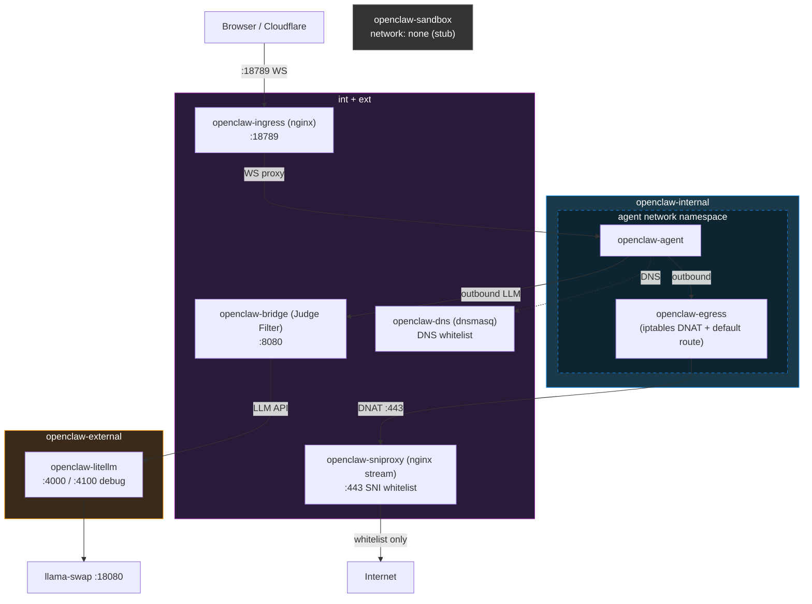

# JudgeClaw

Docker Compose deployment of [OpenClaw](https://github.com/openclaw/openclaw) with a custom security layer that compensates for Docker's weaker isolation compared to VM-based sandboxes.

## Design Principles

- **Agent cannot reach external networks** — internal network only
- **All outbound traffic goes through Bridge/Judge** — Agent cannot reach LiteLLM or the internet directly
- **Bridge/Judge inspects all traffic** with PII regex + Judge LLM (fail-closed)
- **Judge LLM uses a different model** from the Agent LLM — bias isolation
- **Restart-resilient** — `restart: unless-stopped` + Docker Desktop auto-start

## Architecture



## Prerequisites

- Docker (with Docker Compose)
- An OpenAI-compatible LLM server (configurable via `LLAMA_SERVER_URL` in `.env`, default: `http://host.docker.internal:18080/v1`)

## Setup

```bash
cp .env.example .env
# Edit .env: set OPENCLAW_GATEWAY_TOKEN, LITELLM_MASTER_KEY, model names, BRAVE_API_KEY
docker compose up -d
```

First-time browser pairing:

```bash
docker exec openclaw-agent openclaw devices list
docker exec openclaw-agent openclaw devices approve <request-id>
```

## Configuration

| Variable | Description |
|----------|-------------|
| `OPENCLAW_GATEWAY_TOKEN` | Gateway auth token (`openssl rand -hex 32`) |
| `OPENCLAW_PORT` | Ingress port (default: 18789) |
| `LITELLM_MASTER_KEY` | LiteLLM internal key |
| `LLAMA_SERVER_URL` | LLM server URL for Agent model |
| `REASONER_LOCAL_MODEL` | Agent model ID |
| `JUDGE_LOCAL_MODEL` | Judge model ID (via LiteLLM) |
| `PORTABLE_SERVER_URL` | Judge direct fallback URL (skips LiteLLM) |
| `JUDGE_PORTABLE_MODEL` | Judge model ID for direct fallback |
| `BRAVE_API_KEY` | Brave Search API key (web search tool) |

Add domains to `config/whitelist.txt` to expand the SNI/DNS whitelist.

